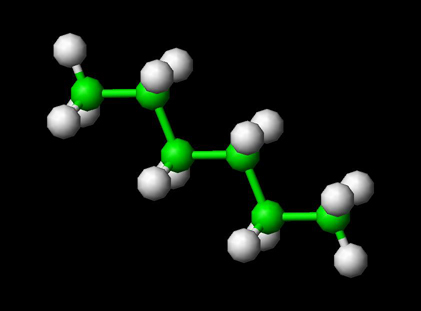

A polyatomic molecule has more than three atoms. Examples are Hexane, Octane etc. The bonded and non-bonded interactions determine the total energy for the molecule. Bonded interactions include bond stretching, bond bending, change in proper and improper dihedral. Non-bonded interactions include electrostatic and van der Waals interactions. The figure below shows a polyatomic molecule hexane.

  

  

  

  

