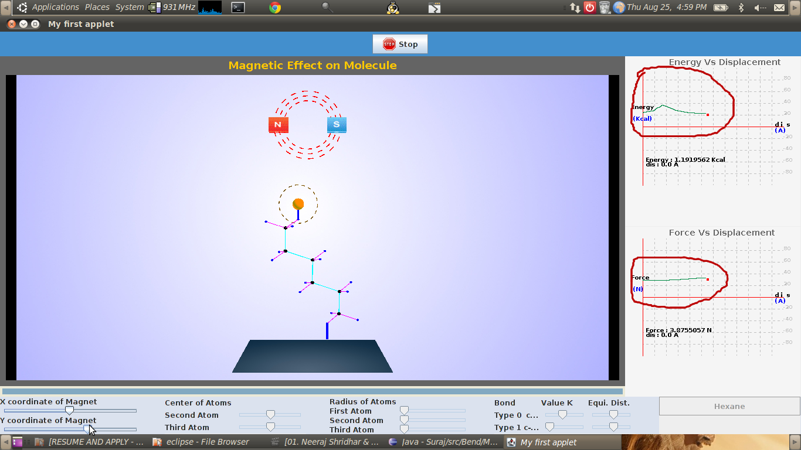

There are certain parameters to be initialized and the procedure detailed here can be followed.  

STEP1:Select the molecule and click on it to perform experiment.

Step2: Click on 'start' to start the experiment.

Step 3: The coordinates of particles can be changed by the position of slider.

Step 4: The force constant values can be varied by changing the position of sliders.

Step 5: The plot of change in energy with respect to change in position of magnet coordinates is seen.

