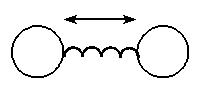
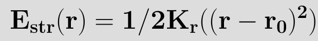
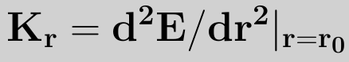
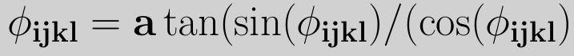
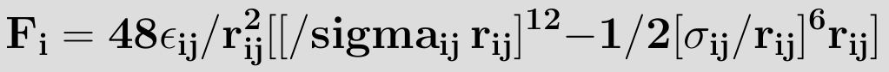
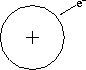
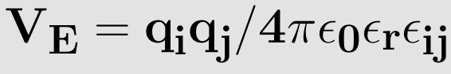

**Bond Stretching:**

The oscillatory motion of two bonded atoms relative to each other. This motion consist of the two bonded atoms stretching passed their equilibrium position, then returning to their equilibrium position, and finally contracting passed their equilibrium position. This kind of motion is called Bond stretching.

The bond stretching can be generally explained by considering just attaching a spring in between two atoms, as shown in the figure below.  

  

When the mass of one of the atoms is thought be high when compared to the other, it is similar to a mass loaded by spring. Hooke's law can be applied to this system. Now the question is, how the energy of this system changes with change in stretching and compression of the bond? To find a functional form for bond stretching interactions it is helpful to consider how the energy of a bond changes with its length. The energy of a bond is lowest at a particular natural or reference length. If the bond is then compressed the electron clouds of the two atoms forming it will gradually overlap. This leads to a rapid increase in energy. If the bond is stretched beyond equilibrium the energy starts to increase. Eventually however, the bond dissociates.

For small deviations from the equilibrium bond length the energy can be written as a taylor expansion in r-r0, with rsub>0/ representing the equilibrium bond-length.

  
 

 In its simplest form,the above equation is terminated at the (r-r0)2 term. This is called the harmonic approximation. setting E(r0)=0, and noting that at r=r0 the force and hence first derivative of the energy is zero, we have 

  
 

where kr is the harmonic force constant given by  

   

 The reference bond length r0 is often called the equilibrium bond length. This is slightly misleading as the reference bond length is the bond length when all the other force field terms are set to 0, while the equilibrium bond length is the bond length for the minimum energy configuration of the molecule (i.e. when Eff=0). The forces between bonded atoms are very high in comparison to other forces. This is the justification for using the harmonic approximation. It is important to remember that this is an approximation to the real bond stretching potential and that for large deviations from r0 the harmonic approximation no longer holds true. For situations where the bond lengths may deviate far from r0 or to accurately calculate molecular structures and vibrational frequencies it is necessary to go beyond the harmonic approximation and include higher order terms usually up to (r-r0)4. At some inter-nuclear distance the atoms are far enough apart so that they do not "feel" each other. That is, they are isolated and the bond is broken. A more realistic model of the potential well of a diatomic molecule is the Morse potential, which does model the dissociation energy.  

**Bond angle:**  

The angle between two bonds sharing a common atom is known as the bond angle.  

   

 
The distortion in the angle of the molecule helps the molecule to store energy in the form of potential energy. This storage of energy in molecule referred as a "strain". The potential energy stored due to the displacement of bond angle from equilibrium positions is called "Angle Strain". For eg: The angle strain in the molecule of cyclopropane renders it to be highly unstable and reactive due large amount of potential energy stored in it.  

As bond angles are found (experimentally and theoretically) to vary around a single value it is sufficient in most applications to use a harmonic representation (in a similar manner to the bond potential)  

   

 
**Dihedral:**  

The angle between two planes is called Dihedral.  

In the figure on the below the definition of the torsional angle for the proper dihedral angle potential can be seen. The torsional angle Φijkl is the angle between the plane going through the atoms i, j and k and the plane going through the atoms j, k and l.
For each of these two planes the normal vectors can be calculated by taking the cross product of two vectors lying in this plane,
where the directions of the vectors have to be chosen in a clever way to get the torsional angle in accordance with the IUPAC/IUB convention. The dihedral angle of two planes can be seen by looking at the planes "edge on", i.e., along their line of intersection. The dihedral angle ΦAB between two planes denoted A and B is the angle between their two normal unit vectors nA and nB: Dihedral angle is also called as face angle.  

    

 

    

 
    
 

For the plane going through the atoms i, j and k this normal vector m is expressed as    

    

For the plane going through the atoms j, k and l this normal vector n is expressed as  

 
  

 
For the torsional angle a similar definition as in (4) can be used. The cosine of the torsional angle Φijkl is expressed as  

  

and the sine of the same angle Φijkl as  

  

where m, n, and rjk are the lengths of the respective vectors. Using the two definitions for the cosine and sine and taking the IUPAC/IUB convention into account, the torsional angle is given by  

  

To model the rotation barriers around bonds in accordance with thermodynamic data, the cosine form of the dihedral potential was introduced, which is expressed as  

  

 
where Kijkl is the force constant belonging to the cosine type of potential, Φ0 the angle where the potential passes through its minimum value, and nijkl is the multiplicity, which indicates the number of minima as the bond is rotated through 3600.
The multiplicity is a nonzero, positive integer number. However, it is not uncommon that the rotation around a bond has local and global minimums. In order to accomodate this type of behavior the potential is split in its underlying harmonic functions, each having its own force constant, multiplicity and reference angle.

**Improper dihedral:**  

Improper dihedral angles are used to select the correct geometry or chirality of atoms. Consider four atoms i,j,k,l among which i is linked covalently to j,l,k. The improper angle is defined as the angle between the (il) line and the plane (ijk)   
                                           
For the improper torsion the torsional angle definition is shown in the figure on the right. The angle Φijkl still depends on the same two planes ijk and jkl, since the atoms have been chosen in the clever way as can be seen
in the figure with the atom i in the center instead on one of the ends of the dihedral chain. By using this definition the same equations, can be used to compute the torsional angle, Since the improper torsion potential is mainly used to maintain planarity in a molecular structure. Hence, it only has one minimum and a harmonic potential may be used. Therefore the improper torsion functional form is given by   

  

where kijkl determines the stiffness of the potential and Φ0 is the equilibrium value 

**van der Waals potential:**  

van der Waals interactions are often referred to as the combination of attractive and repulsive forces between two atoms, which are not bonded to each other. The energy arising from this interaction varies with the separation distance between the two atoms. This energy is zero at infinite distance, but as the separation is reduced the energy decreases, passing through a minimum and from there on increasing rapidly.  

  

The most common potential to model the van der Waals interactions is known as the Lennard-Jones potential,Proposed by Sir John Edward Lennard-Jones, the Lennard-Jones Potential is a mathematical approximation that illustrates the energy of interaction between two non-bonding atoms or molecules based off their distance of separation. which depends only on two parameters and is expressed as  
                                                                         

  

  

  

 here εij is the minimum (well depth) of the potential for the interaction between atom i and j, σij the collision diameter (the separation for which the energy is zero) and rij=|ri-rj| the separation distance.The r12 term, which is the repulsive term, describes Pauli repulsion at short ranges due to overlapping electron orbitals and the r6 term, which is the attractive long-range term, describes attraction at long ranges (van der Waals force, or dispersion force) The attractive part of the potential (the part which contains the power 6) has been experimentally validated. For the repulsive part different powers are suitable, however, the power 12 is used most often, since as a result the potential can be more easily computed, being the square of the attractive part. Commonly the parameters (such as σij and εij) are not given for a specific pair, but as a parameter of the atom itself. To be able to calculate the van der Waals interactions the Lorentz—Berthelot mixing rules are applied to determine the values for the parameters, which are then given 

    

 
where σii, σjj, εii and εjj are the collision diameters for the atoms i and j and the well depths for the atoms i and j respectively. On a graph of the Lennard-Jones potential then, we can see that this value gives the x-intersection of the graph. According to the Lennard-Jones potential, any value of r greater than should yield a negative bonding potential and any value of r smaller than should yield a positive bonding potential. The force exerted by the Lennard-Jones potential on, for instance, atom i, can be derived through a similar expression as equation (2), and is expressed as   

 
  

The strong close in repulsion between atoms or molecules is understandable, resulting from mutual deformation of their structures (meaning, one atom cannot diffuse through another).  
The mild attraction at larger distances is harder to explain. It results from what is called induced dipole-dipole moment interaction of the particles, described as follows.  

When we look at an uncharged atom, we see a symmetrically distributed (round) electron cloud surrounding its nucleus(Fig. 3.5.3.) As a result, the atom has no dipole moment, because no charges are concentrated in any one direction.  

For an uncharged atom, positive charge is located in the center, the negative charge (represented by the outer circle) is symmetrically distributed around it.  
                                                                                                                                                               
                                                                                                                             
 
 
A particle in a liquid is constantly in motion, undergoing collisions and near collisions with other particles. When two uncharged particles approach one another, the electron clouds of the competing particles undergo a deformation. During the interaction, each particle does not have a symmetrical electron cloud. As a result each acquires a dipole moment. This is called an induced dipole moment. It lasts for only the short time of near approach, but during this time particles with dipoles are attracted to each other (see Fig. 3.5.4a and Fig. 3.5.4b). This attraction is called the London or Van der Waals force.  

  

 
Two uncharged particles approach one another. The positive charge is located in the the center, the outer ring represents the symmetrical distribution of negative charge around  
 

  

After a collision or near collision with another particle, each electron cloud undergoes a deformation leading to an induced dipole moment and weak attraction between the particles  

The L-J potential is a relatively good approximation and due to its simplicity is often used to describe the properties of gases, and to model dispersion and overlap interactions in molecular models. It is particularly accurate for noble gas atoms and is a good approximation at long and short distances for neutral atoms and molecules.  

**Electrostatic potential**  

Electro-negative atoms attract electrons more than less electro negative atoms, giving rise to an uneven distribution of charge in a molecule.  
This distribution can be represented in many ways, but one of the most common ways is to represent the charge distribution as point charges localized throughout the molecule, mostly coinciding with the nuclei of the atoms. For ions their charge is also considered to be a point charge.  

The electrostatic interaction (also known as coulomb interaction) between two atoms, in the same or a different molecule, is expressed by using coulomb's law  

 
  

 
where qi and qj are the charges of atoms i and j respectively, ε0 is the permittivity of vacuum (ε0=8.8542×10-12 C2N-1m-2), εR the dielectric constant (εR=1 for a vacuum by definition) and rij is the distance between atoms i and j. Analogous to the derivation of the force with the van der Waals potential we can write for the force exerted on atom i as an effect of the coulomb potential7  
                                                                               

  
